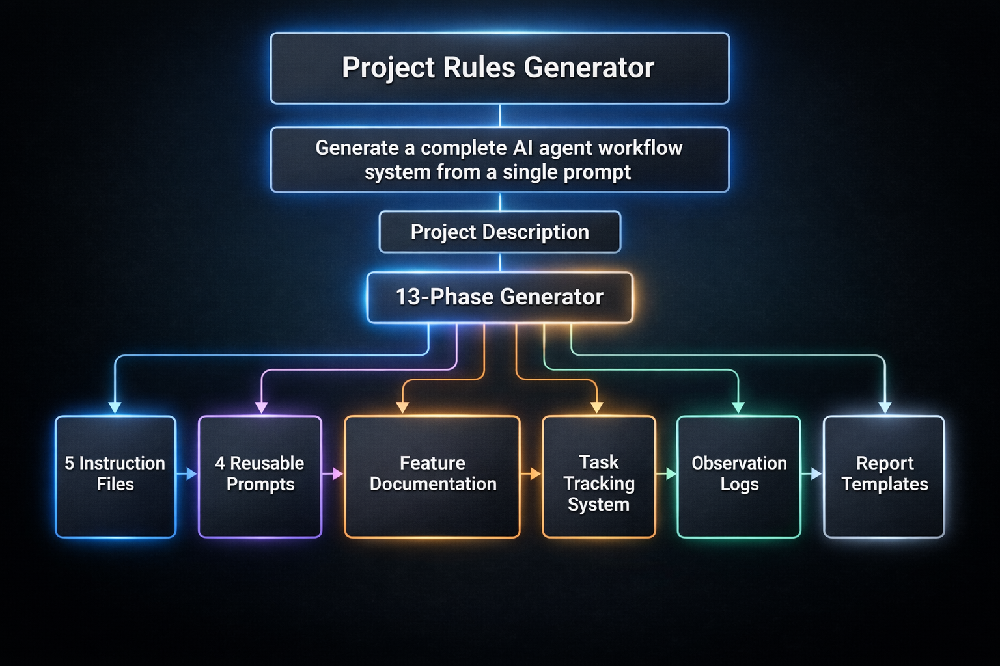
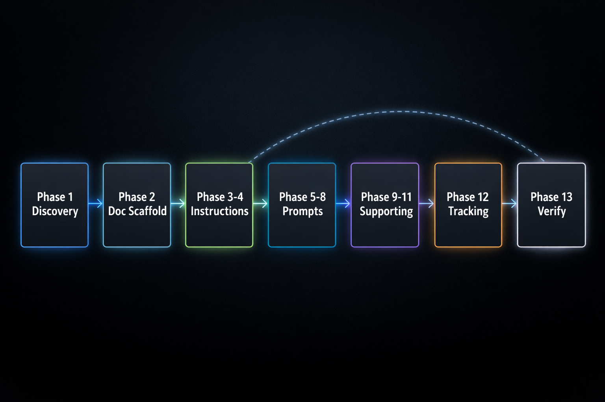
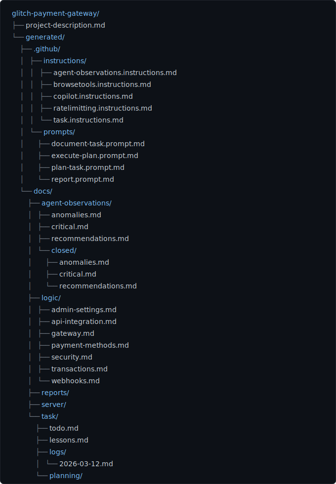

# Project Rules Generator



**Generate a complete project rules system for Copilot and AI coding agents — instructions, prompts, task tracking, documentation scaffolding, reports, and observation logs — from a single prompt.**

---

## What This Is

A reusable prompt that analyzes any software project and generates a full engineering workflow system. Feed it a project description, point it at your codebase, and it produces everything an AI coding agent needs to work effectively: coding conventions, task lifecycle rules, documentation structure, planning templates, and quality gates.

It works with any stack — PHP, TypeScript, Python, Swift, Go, Rust, or anything else. The generator discovers your project's framework, dependencies, and architecture, then produces rules tailored to what it finds.

## What It Generates

```
your-project/
├── .github/
│   ├── instructions/
│   │   ├── copilot.instructions.md          # Project coding guidelines & doc routing
│   │   ├── task.instructions.md             # Blocking gate-checked task lifecycle
│   │   ├── agent-observations.instructions.md # Mandatory observation disclosure
│   │   ├── browsetools.instructions.md      # Browser verification protocol
│   │   └── ratelimitting.instructions.md    # Rate limit prevention rules
│   └── prompts/
│       ├── document-task.prompt.md          # Log completed work
│       ├── plan-task.prompt.md              # Create implementation plans
│       ├── execute-plan.prompt.md           # Execute a planned task
│       └── report.prompt.md                # Generate shareable reports
└── docs/
    ├── logic/                               # Feature docs (one per domain)
    ├── task/                                # Task tracking & daily logs
    │   ├── todo.md
    │   ├── lessons.md
    │   ├── logs/                            # Daily task logs (YYYY-MM-DD.md)
    │   └── planning/                        # Multi-step task plans
    ├── reports/                             # Generated reports
    ├── server/                              # Server & deployment docs
    └── agent-observations/                  # Anomalies, recommendations, critical issues
        ├── critical.md
        ├── recommendations.md
        ├── anomalies.md
        └── closed/                          # Resolved observation archive
```

## Quick Start

1. **Copy the prompt** — Place [`generate-project-rules.prompt.md`](generate-project-rules.prompt.md) into your VS Code user prompts directory or project prompts folder.

2. **Write a project description** — Create a markdown file describing your project, its goals, and key features. See [`examples/glitch-payment-gateway/project-description.md`](examples/glitch-payment-gateway/project-description.md) for reference.

3. **Run the prompt** — In VS Code with GitHub Copilot, invoke the prompt in agent mode and reference your project description file. The generator will discover your project structure, then produce all instruction files, prompts, docs, and scaffolding.

4. **Start working** — The generated rules activate automatically. Your AI agent now follows a structured workflow: plan before coding, track tasks, log observations, verify changes, and document everything.

## How It Works

The generator runs a 13-phase pipeline:



1. **Discovery** — Analyzes your project: framework, language, dependencies, directory layout, rendering stack, dev commands, environment variables, and feature domains.
2. **Documentation scaffolding** — Creates `docs/logic/` files for each discovered feature domain.
3. **Instructions** — Generates 5 instruction files with project-specific coding conventions, task lifecycle rules, browser verification protocols, observation disclosure requirements, and rate limit prevention.
4. **Prompts** — Generates 4 reusable prompt files for planning, execution, documentation, and reporting.
5. **Task tracking** — Creates the full task management structure: `todo.md`, `lessons.md`, daily log directories, and planning directories.
6. **Observation logs** — Creates the agent observation system with critical, recommendations, and anomalies logs.
7. **Verification** — Validates all artifacts against a comprehensive checklist.

## Example



The [`examples/`](examples/) directory contains a complete real-world example:

- **Input:** [`examples/glitch-payment-gateway/project-description.md`](examples/glitch-payment-gateway/project-description.md) — A WooCommerce payment gateway plugin for a South African payment provider.
- **Output:** [`examples/glitch-payment-gateway/generated/`](examples/glitch-payment-gateway/generated/) — The full generated rules system, including 5 instruction files, 4 prompts, 7 feature docs, task tracking, and observation logs.

## Key Features

- **Pointer-based architecture** — Main instructions file stays slim (~250 lines) by pointing to dedicated docs rather than inlining feature logic.
- **Gate-checked task lifecycle** — Every task passes through planning, implementation, verification, observation logging, and documentation gates before completion.
- **Agent observation system** — Forces AI agents to disclose anomalies, recommendations, and critical findings before marking work complete. Silence is a violation.
- **Stack-agnostic** — Works with any language, framework, or platform. The generator discovers your stack and adapts.
- **Daily task ledger** — Automated daily log files track every completed unit of work with categories and types.
- **Self-improvement loop** — Lessons learned from corrections are encoded as rules to prevent repeat mistakes.

## Repository Structure

```
project-rules-generator/
├── generate-project-rules.prompt.md    # The generator prompt (main artifact)
├── README.md
├── LICENSE
├── examples/
│   ├── README.md                       # Example contract & contribution guide
│   └── glitch-payment-gateway/         # Complete real-world example
│       ├── project-description.md      # Input: project description
│       └── generated/                  # Output: generated rules system
├── blog/
│   └── the-ai-architecture-i-built-to-automate-every-project-i-touch.md
└── assets/                             # Visual assets for README & blog
```

## Blog Post

For a deeper look at the thinking behind this system, read the accompanying article:

[**The AI Architecture I Built to Automate Every Project I Touch**](blog/the-ai-architecture-i-built-to-automate-every-project-i-touch.md)

## License

[MIT](LICENSE)
